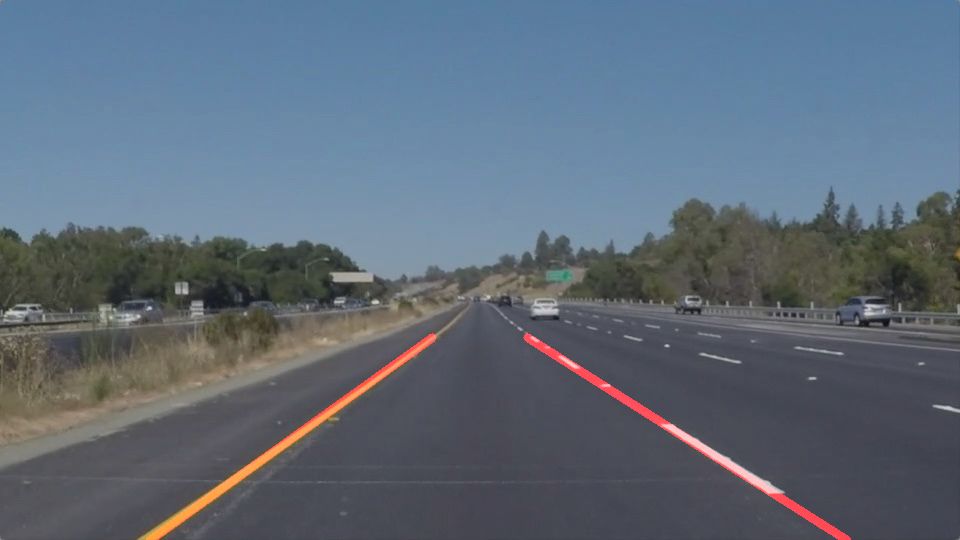

# **Finding Lane Lines on the Road** 

## Writeup

---

### Goals

**Finding Lane Lines on the Road**

The goals / steps of this project are the following:
* Make a pipeline that finds lane lines on the road
* Understanding fundamental of Computer Vision

### Reflection

### 1. Description

Algorithm:

1. Converted the images to grayscale
2. Smooth Image using Gaussian Blur
3. Detect edges on smoothed image using Canny Edge detection
4. Clear edges that is not in the region of interest
5. Detect lines using Hough tranform
6. Qualtify lines that most likely tobe lane lines then devide them into left and right subgroup
7. Averange left group and right into two lines which represent the lane boundary.

Test Image:

### 2. Shortcomings:
This pipeline finds lanes mainly based on edges detection and lines detection. Hence, it might fail to yeild a good result on these senarios:
- Lanes that have big curvature: If the curvature is too big, Hough transform will fail to detect lines
- Lane mark visual quality: If lane are faded or reflective, Canny edge detection will fail to properly detect the edges as straight lines, so the algorithm will fail at next step to detect lines.
Eventhough, twisting parametters will help in some particular cases, this algorithm is heavily depent on image quality, lightning condition, and lane shapes. This will not work on all environments.

### 3. Improvements:
- This algorithm can be improved with auto switching parametters. That mean, adding the ability of automatically switching parametters when lightning or image quality change will help improve the liability of the pipeline
- Another way of improving this pipeline is using CNN based lane lines detection.
